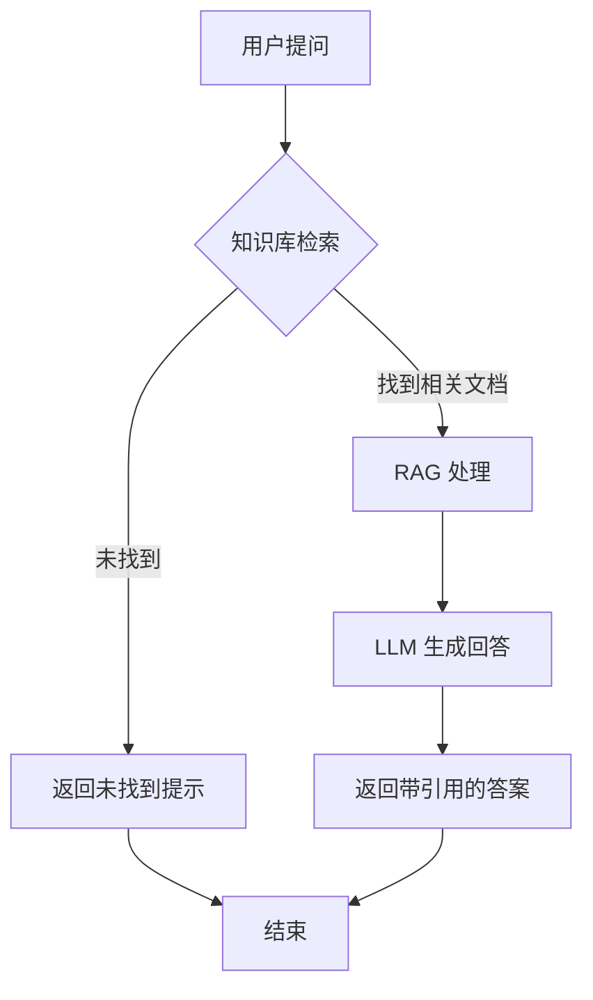
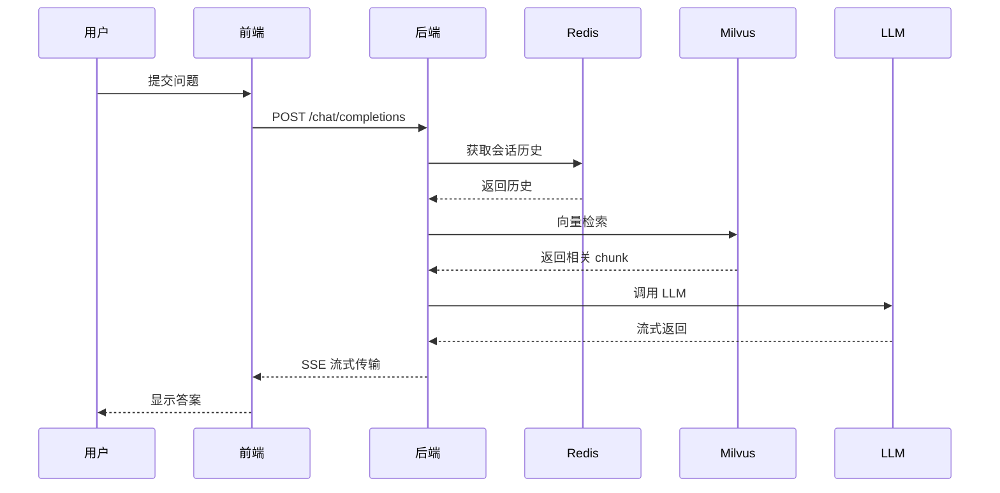
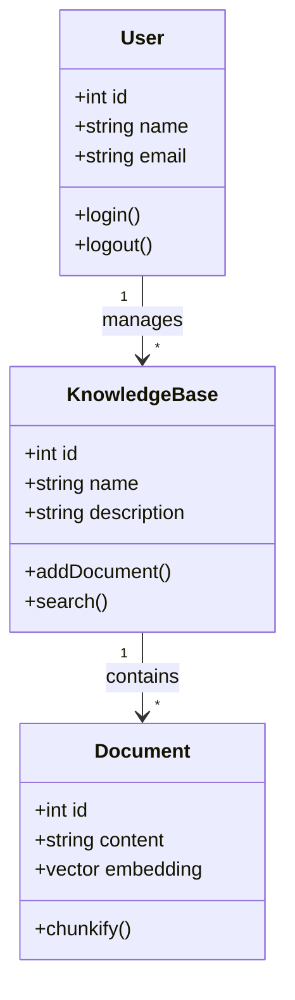

# Markdown 渲染示例

这是一个测试所有支持格式的示例文档。

## 1. 代码块

### Python 代码
```python
def fibonacci(n: int) -> list[int]:
    """生成斐波那契数列"""
    if n <= 0:
        return []
    elif n == 1:
        return [0]
    
    sequence = [0, 1]
    while len(sequence) < n:
        sequence.append(sequence[-1] + sequence[-2])
    
    return sequence

# 打印前 10 个斐波那契数
print(fibonacci(10))
```

### JavaScript 代码
```javascript
async function fetchData(url) {
  const response = await fetch(url);
  const data = await response.json();
  return data;
}
```

### SQL 代码
```sql
SELECT 
    u.name,
    COUNT(o.id) as order_count,
    SUM(o.total) as total_spent
FROM users u
LEFT JOIN orders o ON u.id = o.user_id
WHERE u.created_at >= '2024-01-01'
GROUP BY u.id, u.name
HAVING COUNT(o.id) > 5
ORDER BY total_spent DESC;
```

## 2. 数学公式

### 行内公式
爱因斯坦的质能方程是 $E = mc^2$，其中 $E$ 是能量，$m$ 是质量，$c$ 是光速。

### 块级公式
$$
\\int_{-\\infty}^{\\infty} e^{-x^2} dx = \\sqrt{\\pi}
$$

### 复杂公式
$$
f(x) = \\sum_{n=0}^{\\infty} \\frac{f^{(n)}(0)}{n!} x^n
$$

### 矩阵
$$
\\begin{pmatrix}
a & b \\\\
c & d
\\end{pmatrix}
$$

## 3. 流程图 (Mermaid)



## 4. 时序图 (Mermaid)



## 5. 类图 (Mermaid)



## 6. 表格

### 基础表格
| 姓名 | 年龄 | 城市 | 职业 |
|------|------|------|------|
| 张三 | 28 | 北京 | 工程师 |
| 李四 | 32 | 上海 | 设计师 |
| 王五 | 25 | 深圳 | 产品经理 |

### 带对齐的表格
| 左对齐 | 居中对齐 | 右对齐 |
|:-------|:--------:|-------:|
| A | B | C |
| D | E | F |
| G | H | I |

## 7. 列表

### 无序列表
- 第一项
  - 子项 1
  - 子项 2
- 第二项
- 第三项

### 有序列表
1. 第一步：准备数据
2. 第二步：处理数据
3. 第三步：分析结果
   1. 子步骤 A
   2. 子步骤 B

### 任务列表
- [x] 已完成的任务
- [ ] 待完成的任务
- [ ] 另一个任务

## 8. 引用

> 这是一段引用文字。
> 
> 引用可以包含多段内容。

## 9. 链接

- [Google](https://www.google.com) - 外部链接
- [GitHub](https://github.com) - 另一个外部链接

## 10. 图片


## 11. 混合示例

这是一个综合示例，展示如何在回答中混合使用多种格式：

### API 响应示例

```json
{
  "status": "success",
  "data": {
    "user": "张三",
    "score": 95.5,
    "formula": "E = mc^2"
  }
}
```

根据上面的数据，我们可以计算：

$$
\\text{Total} = \\sum_{i=1}^{n} \\text{score}_i
$$

| 指标 | 值 | 说明 |
|------|-----|------|
| 准确率 | 95.5% | 模型预测准确率 |
| 召回率 | 92.3% | 召回相关文档比例 |
| F1 分数 | 93.9% | 综合评价指标 |

> **注意**：以上数据仅供参考，实际结果可能因数据集而异。
